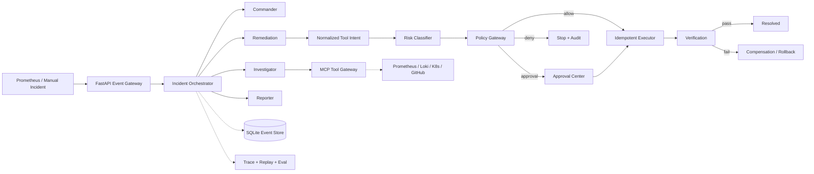
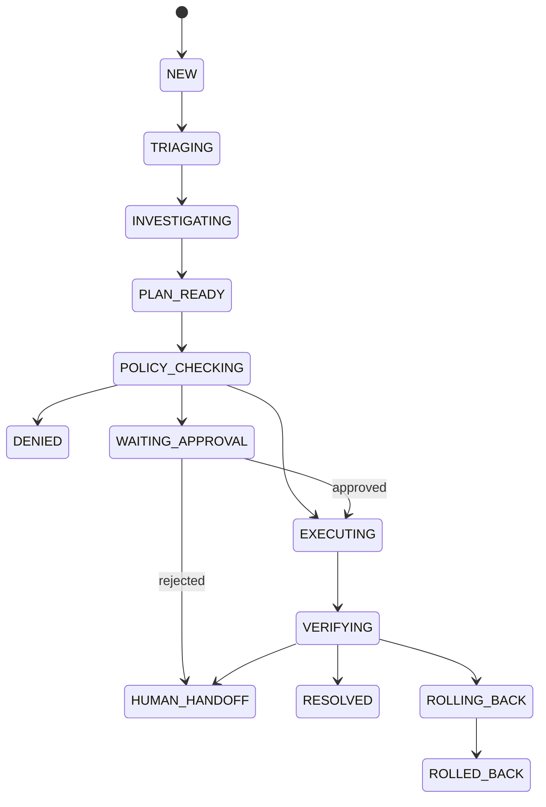

# RunGuard

> Agentic SRE 事故响应与可信执行平台

[](./VERSION)
[](./pyproject.toml)
[](./apps/web/package.json)
[](./LICENSE)

RunGuard 将告警、Agent 调查、风险策略、人工审批、受控执行、效果验证和复盘记录连接为一条可审计的事故响应链路。LLM 只生成结构化 Tool Intent，无法直接获得基础设施凭据；所有写操作必须经过参数校验、风险分级、策略判断、幂等控制与回滚检查。

当前版本：**1.0.0** · 发布日期：**2026-07-24**
作者：**OdeliaLan**

## 1.0 能力

- Prometheus Webhook 与人工 Incident 接入
- Commander、Investigator、Remediation、Reporter 四类 Agent 工作流
- 指标、日志、Kubernetes 状态、发布记录四类 Mock MCP 证据源
- 每条根因假设关联来源 URI 与 Evidence ID
- R0—R3 风险分级和 Policy-as-Code 决策
- 生产写操作人工审批，R3 操作默认拒绝
- Tool Intent 幂等键、before/after snapshot 与补偿动作
- 执行后 SLO 验证和完整 Trace 时间线
- append-only Incident Event 事件记录
- Recorded MCP 重放模式，重放不产生副作用
- 12 个固定故障案例及可复现评测报告
- 响应式 Incident 工作台、Approval Center、Trace Explorer、Evaluation Dashboard、Policy Simulator

> 1.0 默认运行在 `simulation` 模式，不会连接或修改真实集群。

## 快速开始

需要 Python 3.11+、[uv](https://docs.astral.sh/uv/) 和 Node.js 20+。

```bash
git clone https://github.com/Odelialan/RunGuard.git
cd RunGuard
./scripts/dev.sh
```

启动后访问：

- Web：<http://127.0.0.1:5173>
- API 文档：<http://127.0.0.1:8000/docs>
- 健康检查：<http://127.0.0.1:8000/api/health>

也可以分开启动：

```bash
uv sync --extra dev
uv run uvicorn runguard_api.main:app --reload --port 8000

npm --prefix apps/web install
npm --prefix apps/web run dev
```

Docker Compose：

```bash
docker compose up --build
```

## 演示流程

1. 打开 Incidents，进入一个新 Incident。
2. 点击 **Run response**，系统依次完成分级、证据收集、根因推断与修复计划。
3. staging 的可逆 R1 操作自动执行；production 的 R2 操作暂停在 Approval Center。
4. 审核证据、变更差异、策略原因、回滚参数和幂等键后批准或拒绝。
5. 批准后进入模拟沙箱执行并自动验证 P95、错误率和工作负载稳定性。
6. 在 Trace Explorer 查看 Agent、检索、工具、策略、审批、执行和验证 Span。
7. 在 Evaluations 运行 `baseline-12`，生成带范围声明的实测报告。

## 系统架构



1.0 使用 SQLite 实现零依赖本地演示；数据访问层保持独立，可替换为 PostgreSQL。MCP 采用 Transport 接口隔离会话式、无状态、Mock 与 Recorded 实现。

## 可信执行路径

```text
Agent plan
  → normalized Tool Intent
  → schema validation
  → role boundary
  → R0–R3 classification
  → policy decision
  → human approval when required
  → idempotency check
  → simulated restricted execution
  → SLO verification
  → resolve or compensate
```

Tool Intent 示例：

```json
{
  "tool": "kubernetes.patch_deployment",
  "actor": "remediation-agent",
  "incident_id": "INC-2026-00017",
  "environment": "production",
  "resource": {
    "namespace": "production",
    "kind": "Deployment",
    "name": "order-api"
  },
  "arguments": {
    "memory_limit": "1Gi"
  },
  "rollback": {
    "memory_limit": "256Mi"
  },
  "idempotency_key": "inc-2026-00017-action-01"
}
```

## Incident 状态机



状态变化写入 `incident_events`，已有事件不会被覆盖。当前状态是事件流的查询投影。

## 策略决策

| 风险 | 示例 | 1.0 默认策略 |
| --- | --- | --- |
| R0 | 查询指标、日志、Pod 状态 | 自动允许 |
| R1 | staging Deployment 可逆修改 | 自动允许 |
| R2 | production 写操作、无回滚写操作 | 强制审批 |
| R3 | 删除 Namespace、数据库删除、任意 Shell | 拒绝 |

策略源码位于 [`policies/runguard.rego`](./policies/runguard.rego)。没有安装 OPA 时，API 使用等价的内置确定性求值器，便于本地运行；真实部署应由独立 OPA 服务做最终决策。

## 评测集

`baseline-12` 包含：

1. Pod OOMKilled
2. CrashLoopBackOff
3. 镜像拉取失败
4. 副本数不足
5. CPU Limit 过低
6. 数据库连接池耗尽
7. Redis 延迟
8. 错误环境变量
9. Service Selector 错误
10. 最近发布导致异常
11. 日志平台不可用
12. 多个候选根因并存

Dashboard 展示 Top-1/Top-3 根因命中、策略准确率、危险操作拦截、Trace 覆盖、重复副作用、工具调用次数与处理耗时。所有数值明确标注为**确定性模拟评测**，不冒充生产环境效果。

## 仓库结构

```text
RunGuard/
├── agents/prompts/          # 运行所需、版本化的 Agent Prompt
├── apps/api/runguard_api/   # FastAPI、状态机、策略、事件存储、执行与评测
├── apps/web/                # React + TypeScript 操作台
├── deploy/docker/           # API 与 Web 容器配置
├── policies/                # OPA Rego 策略
├── scripts/                 # 本地启动入口
├── .github/workflows/       # CI 类型检查、构建与 API smoke test
├── VERSION
└── README.md
```

## 配置与数据安全

复制 `.env.example` 后按需配置。真实 API Key、Token、kubeconfig、数据库文件、日志、虚拟环境、`node_modules`、构建产物、评测报告和大体积模型/媒体文件均已被 `.gitignore` 排除。

提交前可运行：

```bash
./scripts/check.sh
```

该脚本会检查 Python 静态规则、前端类型与生产构建、API smoke test、Git 追踪文件大小和常见凭据模式。

## 1.0.0 发布记录

**2026-07-24 · Initial release**

- 建立从 Incident 接入到验证结案的完整可信执行闭环。
- 实现四 Agent 编排、MCP Transport 抽象、证据链和结构化根因。
- 实现 R0–R3 风险模型、Rego 策略、人工审批及拒绝后接管。
- 实现幂等执行、执行快照、补偿参数、Trace 与无副作用重放。
- 建立 12 场景确定性评测套件和可交互 Dashboard。
- 完成响应式 Web 工作台、容器化配置、CI 与安全提交检查。

## 已知限制

- 默认工具与模型响应是确定性模拟，尚未连接真实 Prometheus、Loki、Kubernetes 或模型服务。
- 事件存储使用单机 SQLite，不用于高并发或多 Worker 生产部署。
- Rego 文件已提供，但本地 API 的等价求值器不替代生产 OPA 决策点。
- 1.0 不提供完整企业 IAM、多集群调度、任意 Shell 或生产自动执行。
- 自动回滚的数据模型与补偿路径已实现，演示数据默认验证成功；真实集群故障注入留给后续版本。

## License

Copyright 2026 OdeliaLan.

Licensed under the [Apache License 2.0](./LICENSE).
