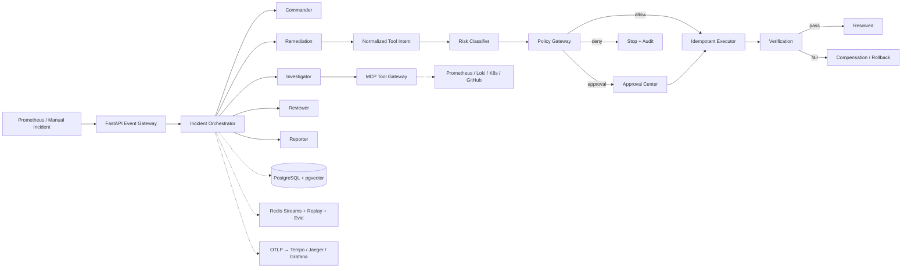
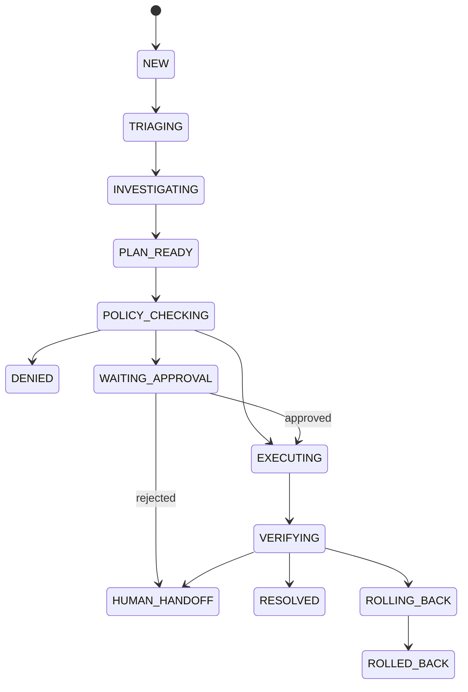

# RunGuard

> Agentic SRE 事故响应与可信执行平台

[](./VERSION)
[](./pyproject.toml)
[](./apps/web/package.json)
[](./LICENSE)

RunGuard 将告警、Agent 调查、风险策略、人工审批、受控执行、效果验证和复盘记录连接为一条可审计的事故响应链路。LLM 只生成结构化 Tool Intent，无法直接获得基础设施凭据；所有写操作必须经过参数校验、风险分级、策略判断、幂等控制与回滚检查。

当前版本：**1.2.0** · 发布日期：**2026-07-26**
作者：**OdeliaLan**

## 1.2 能力

- Prometheus Webhook 与人工 Incident 接入
- Commander、Investigator、Remediation、Reviewer、Reporter 五类 Agent 工作流
- LangGraph 状态图与真实结构化 LLM 输出；本地可切换确定性后端
- Prometheus、Loki、Kubernetes、GitHub 真实连接器与 Mock/Hybrid/Recorded 模式
- 官方 MCP Streamable HTTP 客户端，可连接四类独立远程 MCP Server
- 每条根因假设关联来源 URI 与 Evidence ID
- 独立 OPA 服务执行 Rego 策略，OPA 异常时 fail-closed
- 生产写操作人工审批，R3 操作默认拒绝
- PostgreSQL + pgvector 证据存储、语义检索与 Redis Streams 事件总线
- PostgreSQL LangGraph Checkpointer、外层工作流检查点与重启自动恢复
- Redis 分布式执行锁，防止多副本重复启动、执行或补偿
- Kubernetes Job 沙箱、独立 ServiceAccount、最小 RBAC、RuntimeDefault seccomp
- Tool Intent 幂等键、before/after snapshot、失败验证与真实补偿回滚
- OpenTelemetry OTLP Trace，可接 Tempo/Jaeger 与 Grafana
- append-only Incident Event 事件记录
- Recorded MCP 重放模式，重放不产生副作用
- A2A 1.0 Reviewer Agent Card、JSON-RPC 审查服务与远程 Reviewer Client
- 结构化 Postmortem 页面、JSON/Markdown 导出与行动项
- 12 个固定故障案例及可复现评测报告
- Helm Chart、kind 三节点演示集群与可控故障注入/补偿验证脚本
- 中英文切换、提升字号后的响应式运维工作台
- API Key/OIDC 身份认证、viewer/operator/approver/service/admin RBAC
- Redis 多副本限流、Prometheus Webhook HMAC 验签与安全响应头
- 启动时生产配置 fail-fast，拒绝无鉴权、无 OPA、无沙箱或无持久化的伪生产配置

> 默认仍运行在 `simulation + mock + deterministic` 安全模式。只有显式配置生产连接器、
> OPA、数据库、模型和 `kubernetes_job` 执行模式后，系统才会访问真实基础设施。

## 快速开始

需要 Python 3.11+、[uv](https://docs.astral.sh/uv/) 和 Node.js 20+。

```bash
git clone https://github.com/Odelialan/RunGuard.git
cd RunGuard
./scripts/dev.sh
```

启动后访问：

- Web：<http://127.0.0.1:5173>
- API 文档：<http://127.0.0.1:8000/docs>
- 健康检查：<http://127.0.0.1:8000/api/health>

也可以分开启动：

```bash
uv sync --extra dev
uv run uvicorn runguard_api.main:app --reload --port 8000

npm --prefix apps/web install
npm --prefix apps/web run dev
```

完整 Docker Compose 栈（PostgreSQL/pgvector、Redis、OPA、Prometheus、Loki、
OpenTelemetry Collector、Tempo、Grafana、RunGuard 与故障注入器）：

```bash
docker compose up --build
```

启动后可访问 RunGuard `:5173`、Grafana `:3000`、Prometheus `:9090` 和 Fault
Injector `:8090`。

### kind 真实沙箱与失败补偿

需要 Docker、kind、kubectl 和 Helm：

```bash
./scripts/kind-up.sh
./scripts/kind-failure-demo.sh
```

失败演示会在集群内注入健康检查故障，通过受限 Kubernetes Job 修改 Deployment，在验证
失败后执行补偿 Job，并断言 Incident 进入 `ROLLED_BACK`。完成后运行：

```bash
./scripts/kind-down.sh
```

### 局域网访问

开发模式会同时监听所有网卡。启动后，使用启动日志显示的局域网地址访问：

```bash
./scripts/dev.sh
# Web: http://<本机局域网IP>:5173
# API: http://<本机局域网IP>:8000/docs
```

需要单端口运行时：

```bash
RUNGUARD_PORT=8000 ./scripts/serve.sh
# 前端与 API 共用 http://<本机局域网IP>:8000
```

查看本机局域网 IP：

```bash
hostname -I
```

访问设备需要与运行 RunGuard 的电脑处于同一局域网。若系统启用了防火墙，需要允许 TCP `5173` 和 `8000`；单端口模式只需允许所选端口。不要把模拟模式以外的执行服务直接暴露到不受信任网络。

## 演示流程

1. 打开 Incidents，进入一个新 Incident。
2. 点击 **Run response**，系统依次完成分级、证据收集、根因推断与修复计划。
3. staging 的可逆 R1 操作自动执行；production 的 R2 操作暂停在 Approval Center。
4. 审核证据、变更差异、策略原因、回滚参数和幂等键后批准或拒绝。
5. 批准后进入模拟沙箱执行并自动验证 P95、错误率和工作负载稳定性。
6. 在 Trace Explorer 查看 Agent、检索、工具、策略、审批、执行和验证 Span。
7. 在 Evaluations 运行 `baseline-12`，生成带范围声明的实测报告。

## 系统架构



本地安全模式继续支持 SQLite 零依赖演示；生产模式使用 Psycopg 3 连接 PostgreSQL，
在 Evidence 表启用 pgvector，并通过 Redis Streams 输出可消费、可重放的事故事件。
连接器采用统一 Transport 接口隔离 Production、Hybrid、Mock 与 Recorded 实现。

## 可信执行路径

```text
Agent plan
  → normalized Tool Intent
  → schema validation
  → role boundary
  → R0–R3 classification
  → policy decision
  → human approval when required
  → idempotency check
  → restricted Kubernetes Job execution
  → SLO verification
  → resolve or compensate
```

Tool Intent 示例：

```json
{
  "tool": "kubernetes.patch_deployment",
  "actor": "remediation-agent",
  "incident_id": "INC-2026-00017",
  "environment": "production",
  "resource": {
    "namespace": "production",
    "kind": "Deployment",
    "name": "order-api"
  },
  "arguments": {
    "memory_limit": "1Gi"
  },
  "rollback": {
    "memory_limit": "256Mi"
  },
  "idempotency_key": "inc-2026-00017-action-01"
}
```

## Incident 状态机



状态变化写入 `incident_events`，已有事件不会被覆盖。当前状态是事件流的查询投影。

## 策略决策

| 风险 | 示例 | 1.1 默认策略 |
| --- | --- | --- |
| R0 | 查询指标、日志、Pod 状态 | 自动允许 |
| R1 | staging Deployment 可逆修改 | 自动允许 |
| R2 | production 写操作、无回滚写操作 | 强制审批 |
| R3 | 删除 Namespace、数据库删除、任意 Shell | 拒绝 |

策略源码位于 [`policies/runguard.rego`](./policies/runguard.rego)。本地安全模式可使用等价
Python 求值器；生产设置 `RUNGUARD_POLICY_BACKEND=opa` 后，独立 OPA Data API 是最终决策点，
不可用或返回未定义结果时默认拒绝执行。

## 生产配置

| 配置 | 生产值 | 作用 |
| --- | --- | --- |
| `RUNGUARD_DATABASE_URL` | PostgreSQL DSN | 启用 PostgreSQL/pgvector |
| `RUNGUARD_REDIS_URL` | Redis DSN | 启用 Streams 事件发布 |
| `RUNGUARD_CONNECTOR_MODE` | `production` | 使用真实四类连接器 |
| `RUNGUARD_CONNECTOR_MODE` | `mcp` | 使用远程 Streamable HTTP MCP Server |
| `RUNGUARD_AGENT_BACKEND` | `langgraph` | 使用 LangGraph 与结构化 LLM |
| `RUNGUARD_LANGGRAPH_CHECKPOINT_BACKEND` | `postgres` | 持久化 Graph 节点状态 |
| `RUNGUARD_POLICY_BACKEND` | `opa` | 使用独立 OPA |
| `RUNGUARD_EXECUTION_MODE` | `kubernetes_job` | 使用受限 Job 执行 |
| `RUNGUARD_OTEL_EXPORTER_OTLP_ENDPOINT` | Collector HTTP 端点 | 输出 OTLP Trace |
| `RUNGUARD_A2A_REVIEWER_URL` | A2A JSON-RPC URL | 委托独立 Reviewer |
| `RUNGUARD_AUTH_MODE` | `oidc` 或 `api_key` | 启用身份认证与 RBAC |
| `RUNGUARD_ENFORCE_PRODUCTION_GUARDS` | `true` | 启动时强制校验生产安全基线 |
| `RUNGUARD_AUTO_RECOVER` | `true` | 重启后恢复未完成工作流 |

所有密钥仅通过 Secret/环境变量注入。Helm Chart 不包含真实密钥，安装时必须提供。
生产集群建议预先创建 Secret，并通过 `secrets.existingSecret` 引用，避免把密钥写进
Helm values 或发布记录。

Prometheus Webhook 请求必须携带 Unix 秒时间戳 `X-RunGuard-Timestamp` 与
`X-RunGuard-Signature`。签名内容为
`HMAC-SHA256(secret, "<timestamp>.<raw-body>")`，请求头格式为
`sha256=<hex-digest>`；超过五分钟的请求会被拒绝，以降低重放风险。

## 评测集

`baseline-12` 包含：

1. Pod OOMKilled
2. CrashLoopBackOff
3. 镜像拉取失败
4. 副本数不足
5. CPU Limit 过低
6. 数据库连接池耗尽
7. Redis 延迟
8. 错误环境变量
9. Service Selector 错误
10. 最近发布导致异常
11. 日志平台不可用
12. 多个候选根因并存

Dashboard 展示 Top-1/Top-3 根因命中、策略准确率、危险操作拦截、Trace 覆盖、重复副作用、工具调用次数与处理耗时。所有数值明确标注为**确定性模拟评测**，不冒充生产环境效果。

## 仓库结构

```text
RunGuard/
├── agents/prompts/          # 运行所需、版本化的 Agent Prompt
├── apps/api/runguard_api/   # FastAPI、状态机、策略、事件存储、执行与评测
├── apps/web/                # React + TypeScript 操作台
├── deploy/docker/           # API 与 Web 容器配置
├── deploy/helm/runguard/    # 生产 Helm Chart、RBAC 与安全上下文
├── deploy/kind/             # 本地三节点集群与演示工作负载
├── deploy/observability/    # Prometheus/Loki/Tempo/OTel/Grafana
├── policies/                # OPA Rego 策略
├── services/fault-injector/ # 有鉴权的延迟/错误/健康故障注入器
├── scripts/                 # 本地启动入口
├── .github/workflows/       # CI 类型检查、构建与 API smoke test
├── VERSION
└── README.md
```

## 配置与数据安全

复制 `.env.example` 后按需配置。真实 API Key、Token、kubeconfig、数据库文件、日志、虚拟环境、`node_modules`、构建产物、评测报告和大体积模型/媒体文件均已被 `.gitignore` 排除。

提交前可运行：

```bash
./scripts/check.sh
```

该脚本会检查 Python 静态规则、前端类型与生产构建、API smoke test、Git 追踪文件大小和常见凭据模式。

## 1.2.0 发布记录

**2026-07-26 · Production hardening**

- 增加真实 MCP Streamable HTTP Client；远程 MCP 写操作仍强制经过本地受限 Job。
- 增加 API Key 与 OIDC JWT 鉴权、五级 RBAC 和可信审批人身份绑定。
- 增加 Redis 分布式执行锁与多副本固定窗口限流。
- 增加 Prometheus Webhook HMAC-SHA256 验签、安全响应头和请求追踪 ID。
- 增加 PostgreSQL LangGraph Checkpointer、加密状态和外层工作流检查点。
- 增加安全恢复端点、启动自动恢复、验证续跑和幂等补偿恢复。
- 增加带 advisory lock、checksum 防篡改的顺序数据库迁移。
- Helm 增加生产配置 fail-fast、滚动更新、拓扑分散、Startup Probe 与 ServiceMonitor。
- CI 在强制生产安全配置下验证 OIDC/API Key 边界、迁移、PostgreSQL、Redis 与 OPA。

## 1.1.0 发布记录

**2026-07-24 · Production foundations**

- 接入真实 Prometheus、Loki、Kubernetes、GitHub 数据源与 Hybrid 模式。
- 接入 LangGraph、结构化 LLM 和 A2A Reviewer。
- 启用 PostgreSQL/pgvector、Redis Streams、独立 OPA 与 OTLP。
- 实现受限 Kubernetes Job、ServiceAccount、RBAC、seccomp 和补偿回滚。
- 增加结构化 Postmortem 页面与 Markdown/JSON 导出。
- 增加 Compose、Helm、kind、故障注入服务和真实失败补偿脚本。
- 前端整体字号提升，并支持右上角中英文切换与偏好记忆。

## 1.0.0 发布记录

**2026-07-24 · Initial release**

- 建立从 Incident 接入到验证结案的完整可信执行闭环。
- 实现四 Agent 编排、MCP Transport 抽象、证据链和结构化根因。
- 实现 R0–R3 风险模型、Rego 策略、人工审批及拒绝后接管。
- 实现幂等执行、执行快照、补偿参数、Trace 与无副作用重放。
- 建立 12 场景确定性评测套件和可交互 Dashboard。
- 完成响应式 Web 工作台、容器化配置、CI 与安全提交检查。

## 运行边界

- 任意 Shell、Namespace 删除、数据库删除等 R3 能力不实现，也不会通过策略。
- 生产连接器需要提供对应端点、Token、kubeconfig/集群身份和网络连通性。
- 生产模式必须配置 OIDC 或 API Key；身份提供方中的角色需映射为
  `viewer`、`operator`、`approver`、`service` 或 `admin`。
- 远程 MCP 模式要求四类 MCP Server 使用 Streamable HTTP，并由网络策略或 OAuth
  保护；RunGuard 不把集群写权限交给远程 MCP Server。
- Helm 默认采用单集群、Namespace 级最小权限；企业 SSO、多租户和多集群调度需要按组织
  IAM 与网络边界单独集成。
- 未配置生产依赖时，系统明确显示 Mock/Simulation，不会把模拟数据标记成生产结果。

## License

Copyright 2026 OdeliaLan.

Licensed under the [Apache License 2.0](./LICENSE).
