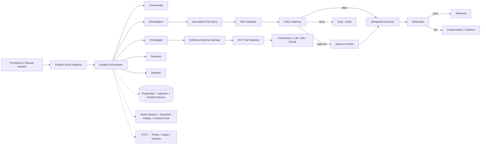
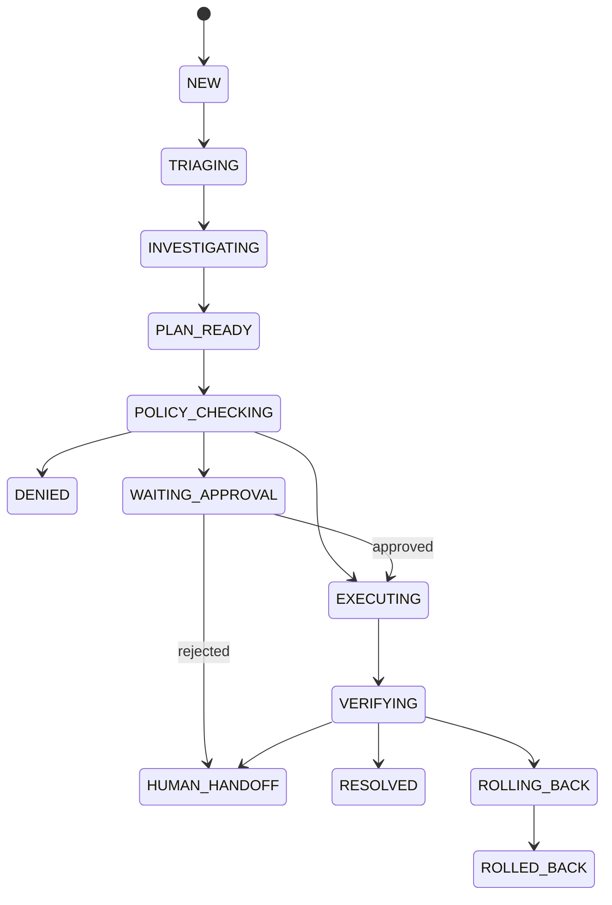

# RunGuard

> Agentic SRE 事故响应与可信执行平台

[](./VERSION)
[](./pyproject.toml)
[](./apps/web/package.json)
[](./LICENSE)

RunGuard 将告警、Agent 调查、风险策略、人工审批、受控执行、效果验证和复盘记录连接为一条可审计的事故响应链路。LLM 只生成结构化 Tool Intent，无法直接获得基础设施凭据；所有写操作必须经过参数校验、风险分级、策略判断、幂等控制与回滚检查。

当前版本：**1.4.0** · 发布日期：**2026-07-28**
作者：**OdeliaLan**

## 1.4 能力

- Prometheus Webhook 与人工 Incident 接入
- Commander、Investigator、Remediation、Reviewer、Reporter 五类 Agent 工作流
- LangGraph 状态图与真实结构化 LLM 输出；本地可切换确定性后端
- Prometheus、Loki、Kubernetes、GitHub 真实连接器与 Mock/Hybrid/Recorded 模式
- 官方 MCP Streamable HTTP 客户端，可连接四类独立远程 MCP Server
- 每条根因假设关联来源 URI 与 Evidence ID
- Evidence Security Gateway 按工具白名单裁剪、递归脱敏并检测提示注入
- Agent 与 A2A 仅接收最小化、带信任分类的证据和历史事故记忆视图
- 独立 OPA 服务执行 Rego 策略，OPA 异常时 fail-closed
- 生产写操作人工审批，R3 操作默认拒绝
- PostgreSQL + pgvector 证据存储、语义检索与 Redis Streams 事件总线
- PostgreSQL LangGraph Checkpointer、外层工作流检查点与重启自动恢复
- 带租约续期的 Redis 分布式执行锁，防止多副本重复启动、执行或补偿
- PostgreSQL 事务型 Outbox 向 Redis Streams 提供至少一次事件投递
- 异步请求路径将同步 Store I/O 隔离到线程池，避免阻塞 Agent 与锁续租事件循环
- Kubernetes Job 沙箱、独立 ServiceAccount、最小 RBAC、RuntimeDefault seccomp
- Tool Intent 幂等键、持久化 before/after snapshot、失败验证与真实补偿回滚
- 生产验证同时检查 P95、错误率与 Deployment 就绪副本
- OpenTelemetry OTLP Trace，可接 Tempo/Jaeger 与 Grafana
- append-only Incident Event 事件记录
- Recorded MCP Transport 会重放只读工具响应并校验已记录的结构化模型产物
- A2A 1.0 Reviewer Agent Card、远程 Client 与独立 Reviewer 部署单元
- Direct、Shadow 与基于 Gateway API HTTPRoute 的 5%/25%/50% Canary 流量执行策略
- 每次 Incident 的工具调用、累计模型 Token、单次模型输出与活动时间预算
- kind 中可重复执行的 12 类真实 Kubernetes 故障注入、观测和恢复实验
- Release 镜像 digest 固定、SPDX SBOM、GitHub OIDC provenance、Cosign keyless 签名及 Kyverno 准入策略
- 结构化 Postmortem 页面、JSON/Markdown 导出与行动项
- 12 个实际执行策略、证据安全与 Recorded Replay 代码的契约评测
- Helm Chart、kind 三节点演示集群与可控故障注入/补偿验证脚本
- 中英文切换、提升字号后的响应式运维工作台
- API Key/OIDC 身份认证、viewer/operator/approver/service/admin RBAC
- Redis 多副本限流、Prometheus Webhook HMAC 验签与安全响应头
- 启动时生产配置 fail-fast，拒绝无鉴权、无 OPA、无沙箱或无持久化的伪生产配置

> 默认仍运行在 `simulation + mock + deterministic` 安全模式。只有显式配置生产连接器、
> OPA、数据库、模型和 `kubernetes_job` 执行模式后，系统才会访问真实基础设施。

## 快速开始

需要 Python 3.11+、[uv](https://docs.astral.sh/uv/) 和 Node.js 20+。

```bash
git clone https://github.com/Odelialan/RunGuard.git
cd RunGuard
./scripts/dev.sh
```

启动后访问：

- Web：<http://127.0.0.1:5173>
- API 文档：<http://127.0.0.1:8000/docs>
- 健康检查：<http://127.0.0.1:8000/api/health>

也可以分开启动：

```bash
uv sync --extra dev
uv run uvicorn runguard_api.main:app --reload --port 8000

npm --prefix apps/web install
npm --prefix apps/web run dev
```

完整 Docker Compose 栈（PostgreSQL/pgvector、Redis、OPA、Prometheus、Loki、
OpenTelemetry Collector、Tempo、Grafana、RunGuard 与故障注入器）：

```bash
docker compose up --build
```

启动后可访问 RunGuard `:5173`、Grafana `:3000`、Prometheus `:9090` 和 Fault
Injector `:8090`。

### kind 真实沙箱与失败补偿

需要 Docker、kind、kubectl 和 Helm：

```bash
./scripts/kind-up.sh
./scripts/kind-failure-demo.sh
```

失败演示会在集群内注入健康检查故障，通过受限 Kubernetes Job 修改 Deployment，在验证
失败后执行补偿 Job，并断言 Incident 进入 `ROLLED_BACK`。完成后运行：

```bash
./scripts/kind-down.sh
```

### 局域网访问

开发模式会同时监听所有网卡。启动后，使用启动日志显示的局域网地址访问：

```bash
./scripts/dev.sh
# Web: http://<本机局域网IP>:5173
# API: http://<本机局域网IP>:8000/docs
```

需要单端口运行时：

```bash
RUNGUARD_PORT=8000 ./scripts/serve.sh
# 前端与 API 共用 http://<本机局域网IP>:8000
```

查看本机局域网 IP：

```bash
hostname -I
```

访问设备需要与运行 RunGuard 的电脑处于同一局域网。若系统启用了防火墙，需要允许 TCP `5173` 和 `8000`；单端口模式只需允许所选端口。不要把模拟模式以外的执行服务直接暴露到不受信任网络。

## 演示流程

1. 打开 Incidents，进入一个新 Incident。
2. 点击 **Run response**，系统依次完成分级、证据收集、根因推断与修复计划。
3. staging 的可逆 R1 操作自动执行；production 的 R2 操作暂停在 Approval Center。
4. 审核证据、变更差异、策略原因、回滚参数和幂等键后批准或拒绝。
5. 批准后进入模拟沙箱执行并自动验证 P95、错误率和工作负载稳定性。
6. 在 Trace Explorer 查看 Agent、检索、工具、策略、审批、执行和验证 Span。
7. 在 Evaluations 运行 `baseline-12`，生成带范围声明和原始案例结果的实测契约报告。

## 系统架构



本地安全模式继续支持 SQLite 零依赖演示；生产模式使用 Psycopg 3 连接 PostgreSQL，
在 Evidence 表启用 pgvector，并通过事务型 Outbox 向 Redis Streams 输出可消费、
可重放的事故事件。每条 Stream 消息包含稳定 `event_id`，消费者应使用它去重。
连接器采用统一 Transport 接口隔离 Production、Hybrid、Mock 与 Recorded 实现。

## 可信执行路径

```text
Agent plan
  → normalized Tool Intent
  → schema validation
  → role boundary
  → R0–R3 classification
  → policy decision
  → human approval when required
  → idempotency check
  → restricted Kubernetes Job execution
  → SLO verification
  → resolve or compensate
```

Tool Intent 示例：

```json
{
  "tool": "kubernetes.patch_deployment",
  "actor": "remediation-agent",
  "incident_id": "INC-2026-00017",
  "environment": "production",
  "resource": {
    "namespace": "production",
    "kind": "Deployment",
    "name": "order-api"
  },
  "arguments": {
    "memory_limit": "1Gi"
  },
  "rollback": {
    "memory_limit": "256Mi"
  },
  "idempotency_key": "inc-2026-00017-action-01"
}
```

## Incident 状态机



状态变化写入 `incident_events`，已有事件不会被覆盖。当前状态是事件流的查询投影。

## 策略决策

| 风险 | 示例 | 1.3 默认策略 |
| --- | --- | --- |
| R0 | 查询指标、日志、Pod 状态 | 自动允许 |
| R1 | staging Deployment 可逆修改 | 自动允许 |
| R2 | production 写操作、无回滚写操作 | 强制审批 |
| R3 | 删除 Namespace、数据库删除、任意 Shell | 拒绝 |

策略源码位于 [`policies/runguard.rego`](./policies/runguard.rego)。本地安全模式可使用等价
Python 求值器；生产设置 `RUNGUARD_POLICY_BACKEND=opa` 后，独立 OPA Data API 是最终决策点，
不可用或返回未定义结果时默认拒绝执行。

## 生产配置

| 配置 | 生产值 | 作用 |
| --- | --- | --- |
| `RUNGUARD_DATABASE_URL` | PostgreSQL DSN | 启用 PostgreSQL/pgvector |
| `RUNGUARD_REDIS_URL` | Redis DSN | 启用 Streams 事件发布 |
| `RUNGUARD_CONNECTOR_MODE` | `production` | 使用真实四类连接器 |
| `RUNGUARD_CONNECTOR_MODE` | `mcp` | 使用远程 Streamable HTTP MCP Server |
| `RUNGUARD_AGENT_BACKEND` | `langgraph` | 使用 LangGraph 与结构化 LLM |
| `RUNGUARD_LANGGRAPH_CHECKPOINT_BACKEND` | `postgres` | 持久化 Graph 节点状态 |
| `RUNGUARD_POLICY_BACKEND` | `opa` | 使用独立 OPA |
| `RUNGUARD_EXECUTION_MODE` | `kubernetes_job` | 使用受限 Job 执行 |
| `RUNGUARD_EXECUTION_STRATEGY` | `direct`、`shadow` 或 `canary` | 控制零副作用或渐进执行策略 |
| `RUNGUARD_TARGET_INVENTORY_JSON` | 服务到环境/Namespace/资源名的映射 | 服务端绑定真实执行目标，拒绝客户端或 Agent 改写环境 |
| `RUNGUARD_OTEL_EXPORTER_OTLP_ENDPOINT` | Collector HTTP 端点 | 输出 OTLP Trace |
| `RUNGUARD_A2A_REVIEWER_URL` | HTTPS 或集群内 `.svc` A2A URL | 委托独立 Reviewer |
| `RUNGUARD_A2A_REVIEWER_TOKEN` | 独立随机 Bearer Token | 认证 API 到 Reviewer 的服务调用 |
| `RUNGUARD_AUTH_MODE` | `oidc` 或 `api_key` | 启用身份认证与 RBAC |
| `RUNGUARD_PREAUTH_RATE_LIMIT_PER_MINUTE` | `30` | 在 OIDC/JWKS 验证前限制来源请求 |
| `RUNGUARD_PROTECT_DIAGNOSTICS` | `true` | 保护 Readiness 与 Metrics |
| `RUNGUARD_DIAGNOSTICS_TOKEN` | 独立随机 Token | Kubernetes Probe 与 Prometheus 专用 |
| `RUNGUARD_INCIDENT_TOOL_CALL_BUDGET` | `24` | 限制单次事故自动工具调用 |
| `RUNGUARD_INCIDENT_TIMEOUT_SECONDS` | `900` | 限制单段自动处理活动时间 |
| `RUNGUARD_INCIDENT_TOKEN_BUDGET_PER_CALL` | `4096` | 限制每个结构化模型节点输出 |
| `RUNGUARD_INCIDENT_TOKEN_BUDGET_TOTAL` | `100000` | 约束整次 Incident 的累计模型用量；缺少供应商 usage 时采用保守本地上界 |
| `RUNGUARD_CANARY_TRAFFIC_STEPS` | `5,25,50` | Gateway API HTTPRoute 渐进流量权重 |
| `RUNGUARD_EGRESS_PROXY_URL` | 集群内 egress gateway | 外部 HTTPS 仅允许通过受控代理 |
| `RUNGUARD_PUBLIC_BASE_URL` | `https://runguard.example.com` | 固定 Agent Card 公网地址，避免信任请求 Host |
| `RUNGUARD_MAX_REQUEST_BODY_BYTES` | `1048576` | 限制写请求体，包含无 Content-Length 的流式请求 |
| `RUNGUARD_ENFORCE_PRODUCTION_GUARDS` | `true` | 启动时强制校验生产安全基线 |
| `RUNGUARD_AUTO_RECOVER` | `true` | 重启后恢复未完成工作流 |

生产目标清单示例：

```json
{
  "order-api": {
    "environment": "production",
    "namespace": "runguard-system",
    "name": "order-api",
    "canary_name": "order-api-canary",
    "http_route_name": "order-api",
    "stable_service": "order-api",
    "canary_service": "order-api-canary"
  }
}
```

Helm 生产安装还要求 API、Runner 与 Reviewer 镜像 digest，执行控制面和 Runner
均以不可变镜像摘要部署。事件中提交的 `environment` 必须与目标清单一致。
手工部署时，`RUNGUARD_KUBERNETES_RUNNER_IMAGE` 同样必须使用
`repository@sha256:<64位摘要>` 格式。

所有密钥仅通过 Secret/环境变量注入。Helm Chart 不包含真实密钥，安装时必须提供。
生产集群建议预先创建 Secret，并通过 `secrets.existingSecret` 引用，避免把密钥写进
Helm values 或发布记录。

Prometheus Webhook 请求必须携带 Unix 秒时间戳 `X-RunGuard-Timestamp` 与
`X-RunGuard-Signature`。签名内容为
`HMAC-SHA256(secret, "<timestamp>.<raw-body>")`，请求头格式为
`sha256=<hex-digest>`；超过五分钟的请求会被拒绝，以降低重放风险。
相同标签与 `startsAt` 的重复通知只创建一个 Incident，非 `firing` 通知不会创建 Incident。

## 评测集

`baseline-12` 包含：

1. Pod OOMKilled
2. CrashLoopBackOff
3. 镜像拉取失败
4. 副本数不足
5. CPU Limit 过低
6. 数据库连接池耗尽
7. Redis 延迟
8. 错误环境变量
9. Service Selector 错误
10. 最近发布导致异常
11. 日志平台不可用
12. 多个候选根因并存

Dashboard 展示实际执行得到的根因规则契约、策略决策、危险操作拦截、证据安全、Recorded Replay、工具调用次数与处理耗时。默认 `baseline-12` 会执行当前 Python 策略、字段白名单、秘密脱敏、提示注入检测和严格 Recorded Transport；它不执行外部模型或真实 Kubernetes 故障，因此只代表代码契约，不代表生产 SRE 效果。Top-1/Top-3 RCA 等模型质量指标在该模式下明确返回不可用，不再把固定规则命中率展示为模型准确率。

CI 的 `live-kubernetes-12` Job 会在临时 kind 集群创建并观察 12 类真实故障，
逐项执行恢复并上传不可变 JSON 证据。付费外部模型评测必须通过
`workflow_dispatch` 显式启用，并提供独立的 `RUNGUARD_EVAL_OPENAI_API_KEY` Secret；
它消费真实实验产物并计算 Top-1/Top-3，而不会把未执行的结果写成成绩。

## PRD 验收状态

| 范围 | 当前结论 |
| --- | --- |
| P0 事故闭环 | 告警/人工接入、工作台、Agent 编排、工具网关、证据引用、OPA、审批、检查点、幂等执行、验证、补偿、Trace 与 Postmortem 已形成可执行闭环。 |
| P0 数据可靠性 | PostgreSQL/pgvector、Redis Streams、事务 Outbox、分布式锁和数据库级 append-only Incident Event 已实现；生产模式会拒绝 SQLite、内存检查点和无 Redis 配置。 |
| P0 评测 | 保留 12 项代码契约；新增 kind 中 12 类真实 Kubernetes 故障注入、观测和逐项恢复，CI 上传实验 JSON。外部模型评测已形成显式付费工作流，只有实际执行后才产出 Top-1/Top-3。 |
| P1 Reviewer | 可独立部署并通过 A2A 调用，检查精确工具白名单、证据引用、参数和有效补偿；OPA 仍是最终授权点。 |
| P1 Replay | Recorded 模型节点及读写工具轨迹按顺序和参数重放，禁止真实模型/工具调用，报告副作用固定为 0。 |
| P1 Shadow/Canary | Shadow 为零写入；Canary 先变更独立 Deployment，再通过 inventory 绑定的 Gateway API HTTPRoute 执行 5%/25%/50% 流量和逐级 SLO 验证，失败立即归零并补偿。 |
| P1 Memory | 仅从同服务且已 `RESOLVED/ROLLED_BACK` 的事故中检索；进入 Agent 前再次脱敏、注入检测和隔离。 |
| P1 版本与预算 | Run 关联 Prompt、Graph、Policy 与模型配置；工具、活动时间、单次输出和累计模型 Token 均受限。供应商缺少 usage 时使用 UTF-8 字节与协议余量形成保守上界，不再记为零。 |
| 部署验收 | Helm 可 lint/render；Dockerfile、Compose 和 kind 第三方镜像固定 digest。Tag 构建生成 SPDX SBOM、provenance、Cosign 签名并由 Kyverno 策略在准入阶段校验。 |

## 仓库结构

```text
RunGuard/
├── agents/prompts/          # 运行所需、版本化的 Agent Prompt
├── apps/api/runguard_api/   # FastAPI、状态机、策略、事件存储、执行与评测
├── apps/web/                # React + TypeScript 操作台
├── deploy/docker/           # API 与 Web 容器配置
├── deploy/helm/runguard/    # 生产 Helm Chart、RBAC 与安全上下文
├── deploy/kind/             # 本地三节点集群与演示工作负载
├── deploy/observability/    # Prometheus/Loki/Tempo/OTel/Grafana
├── policies/                # OPA Rego 策略
├── services/fault-injector/ # 有鉴权的延迟/错误/健康故障注入器
├── scripts/                 # 本地启动入口
├── .github/workflows/       # CI 类型检查、构建与 API smoke test
├── VERSION
└── README.md
```

## 配置与数据安全

复制 `.env.example` 后按需配置。真实 API Key、Token、kubeconfig、数据库文件、日志、虚拟环境、`node_modules`、构建产物、评测报告和大体积模型/媒体文件均已被 `.gitignore` 排除。

提交前可运行：

```bash
./scripts/check.sh
```

该脚本会检查 Python 静态规则、前端类型与生产构建、API smoke test、Git 追踪文件大小和常见凭据模式。

## 1.4.0 发布记录

**2026-07-28 · Measurable production assurance**

- 新增 `live-kubernetes-12`：在临时 kind 集群注入并观察 OOM、CrashLoop、
  ImagePull、不可用副本、CPU Throttle、连接池耗尽、Redis 延迟、错误环境变量、
  Selector 错误、发布回归、日志平台不可用和复合故障，并逐项执行恢复。
- 新增显式付费外部模型评测入口；只有具备独立评测 API Key 并实际运行时才生成
  Top-1/Top-3 成绩。
- Canary 通过 inventory 绑定的 Gateway API HTTPRoute 逐级切换
  5%/25%/50% 流量，每级重新验证；任何失败都会先将流量归零再执行工作负载补偿。
- 模型调用增加 Incident 累计 Token 硬预算；provider usage 缺失或偏低时使用本地
  保守上界记账并 fail-closed。
- PostgreSQL append-only 约束由静默忽略升级为数据库异常拒绝；CI 对 UPDATE 与
  DELETE 执行真实破坏性断言。
- 删除任意目的地 443 网络规则，外部 HTTPS 仅允许到标签绑定的 egress gateway，
  Kubernetes API 仅允许配置的 CIDR。
- 所有 Dockerfile 基础阶段、Compose 和 kind 第三方镜像固定 SHA-256 digest；
  tag 发布生成多架构镜像、SPDX SBOM、provenance 和 Cosign keyless 签名。
- 新增 Kyverno `verifyImages` 准入策略，并将 GitHub Actions 固定到不可变 commit SHA。

## 1.3.0 发布记录

**2026-07-28 · Trust boundary completion**

- 新增 Evidence Security Gateway：工具级字段白名单、秘密脱敏、长度限制、注入检测和双层 Agent 数据隔离。
- 命中提示注入指标的 Incident、Evidence 或 Memory 文本不再进入模型正文，而以隔离占位符替代；原始审计记录留在存储层供人工检查。
- 历史同服务 Incident Memory 自动进入调查上下文；启用 pgvector 时优先使用语义检索。
- Replay API 按原顺序和参数严格重放已记录的读写工具结果，并重新执行 Recorded 模型节点数据流；整个过程不调用外部工具或模型且副作用为零，缺少完整轨迹的旧 Run 明确返回 `UNREPLAYABLE`。
- `baseline-12` 改为实际运行策略、证据安全与 Recorded Replay 契约并记录实测耗时；固定规则命中率不再冒充 Top-1/Top-3 模型质量。
- OIDC/API Key 验证前增加按来源限流；生产 Readiness 与 Metrics 需要独立诊断令牌，Liveness 改为无依赖轻量检查。
- 增加可单独构建和部署、无数据库及集群凭据的 A2A Reviewer 服务。
- 增加 Shadow 零副作用路径、绑定 `canary_name` 的 Canary 先行执行/验证/失败补偿，以及 Incident 工具调用、活动时间和单次模型输出上限。
- OPA 非法决策、OIDC 对称算法和跨 Namespace 宽泛依赖访问改为 fail-closed；Incident Event 在数据库层拒绝更新与删除。

## 1.2.1 发布记录

**2026-07-26 · Adversarial reliability review**

- 将 Webhook HMAC 验签前置到限流之前，避免无效请求抢占合法告警预算。
- 增加事务型 Outbox、稳定 Event ID、执行锁租约续期和同步 Store I/O 线程隔离。
- 增加生产目标清单、不可变 Runner 镜像摘要、请求体限制与告警入口去重。
- Kubernetes Runner 将真实 before snapshot 与幂等标记一同持久化；Scale 变更改为单次原子 Deployment patch。
- 幂等重放恢复原始 before snapshot，避免进程崩溃后生成错误补偿参数。
- 生产验证由单一延迟信号扩展为 P95、错误率和 Deployment 就绪副本三方验证。
- 调查证据新增 Deployment 状态，补齐工作负载证据。
- 对齐 MCP 工具发现结果并删除执行器不再使用的 Kubernetes RBAC 权限。
- 明确 `baseline-12` 为静态参考夹具，移除“已实测”表述。
- 扩充本地缓存、覆盖率报告、私有草稿和大文件忽略规则；运行所需 Prompt 与自动化测试继续版本化。

## 1.2.0 发布记录

**2026-07-26 · Production hardening**

- 增加真实 MCP Streamable HTTP Client；远程 MCP 写操作仍强制经过本地受限 Job。
- 增加 API Key 与 OIDC JWT 鉴权、五级 RBAC 和可信审批人身份绑定。
- 增加 Redis 分布式执行锁与多副本固定窗口限流。
- 增加 Prometheus Webhook HMAC-SHA256 验签、安全响应头和请求追踪 ID。
- 增加 PostgreSQL LangGraph Checkpointer、加密状态和外层工作流检查点。
- 增加安全恢复端点、启动自动恢复、验证续跑和幂等补偿恢复。
- 增加带 advisory lock、checksum 防篡改的顺序数据库迁移。
- Helm 增加生产配置 fail-fast、滚动更新、拓扑分散、Startup Probe 与 ServiceMonitor。
- CI 在强制生产安全配置下验证 OIDC/API Key 边界、迁移、PostgreSQL、Redis 与 OPA。

## 1.1.0 发布记录

**2026-07-24 · Production foundations**

- 接入真实 Prometheus、Loki、Kubernetes、GitHub 数据源与 Hybrid 模式。
- 接入 LangGraph、结构化 LLM 和 A2A Reviewer。
- 启用 PostgreSQL/pgvector、Redis Streams、独立 OPA 与 OTLP。
- 实现受限 Kubernetes Job、ServiceAccount、RBAC、seccomp 和补偿回滚。
- 增加结构化 Postmortem 页面与 Markdown/JSON 导出。
- 增加 Compose、Helm、kind、故障注入服务和真实失败补偿脚本。
- 前端整体字号提升，并支持右上角中英文切换与偏好记忆。

## 1.0.0 发布记录

**2026-07-24 · Initial release**

- 建立从 Incident 接入到验证结案的完整可信执行闭环。
- 实现四 Agent 编排、MCP Transport 抽象、证据链和结构化根因。
- 实现 R0–R3 风险模型、Rego 策略、人工审批及拒绝后接管。
- 实现幂等执行、执行快照、补偿参数、Trace 与无副作用重放。
- 建立 12 场景确定性评测套件和可交互 Dashboard。
- 完成响应式 Web 工作台、容器化配置、CI 与安全提交检查。

## 运行边界

- 任意 Shell、Namespace 删除、数据库删除等 R3 能力不实现，也不会通过策略。
- 生产连接器需要提供对应端点、Token、kubeconfig/集群身份和网络连通性。
- 生产模式必须配置 OIDC 或 API Key；身份提供方中的角色需映射为
  `viewer`、`operator`、`approver`、`service` 或 `admin`。
- 远程 MCP 模式要求四类 MCP Server 使用 Streamable HTTP，并由网络策略或 OAuth
  保护；只有精确只读白名单会发送到远程 Server，基础设施写入始终留在本地受限 Job。
- Helm 默认采用单集群、Namespace 级最小权限；企业 SSO、多租户和多集群调度需要按组织
  IAM 与网络边界单独集成。
- 未配置生产依赖时，系统明确显示 Mock/Simulation，不会把模拟数据标记成生产结果。
- `baseline-12` 仍只是实测代码契约，不能作为线上效果指标；真实故障结果来自
  `live-kubernetes-12`，外部模型结果来自显式启动的独立工作流。
- v1.3.0 之前没有完整 recording 的 Run 会返回 `UNREPLAYABLE`，不会伪装成确定性重放。
- 生产模式必须配置外部 A2A Reviewer；仓库同时保留嵌入式 Reviewer 供本地开发。
- Canary 需要集群安装 Gateway API，并在目标清单绑定 HTTPRoute、稳定 Service 和
  Canary Service；不满足绑定时启动校验或执行会 fail-closed。
- 模型累计用量是安全预算而非账单：供应商 usage 与保守本地上界取较大值，因此可能
  高估，但不会因供应商不返回 usage 而失去上限。
- 生产集群必须提供 egress gateway、正确的 Kubernetes API CIDR，并安装 Kyverno
  才能执行签名准入；Chart 不负责部署这些集群级基础设施。
- 当前工作站没有 Docker，因此本地无法复现 kind/多架构构建；这些验收由 GitHub
  Hosted Runner 执行，仓库不会把“工作流已实现”表述为“某次远端运行已通过”。

## License

Copyright 2026 OdeliaLan.

Licensed under the [Apache License 2.0](./LICENSE).
